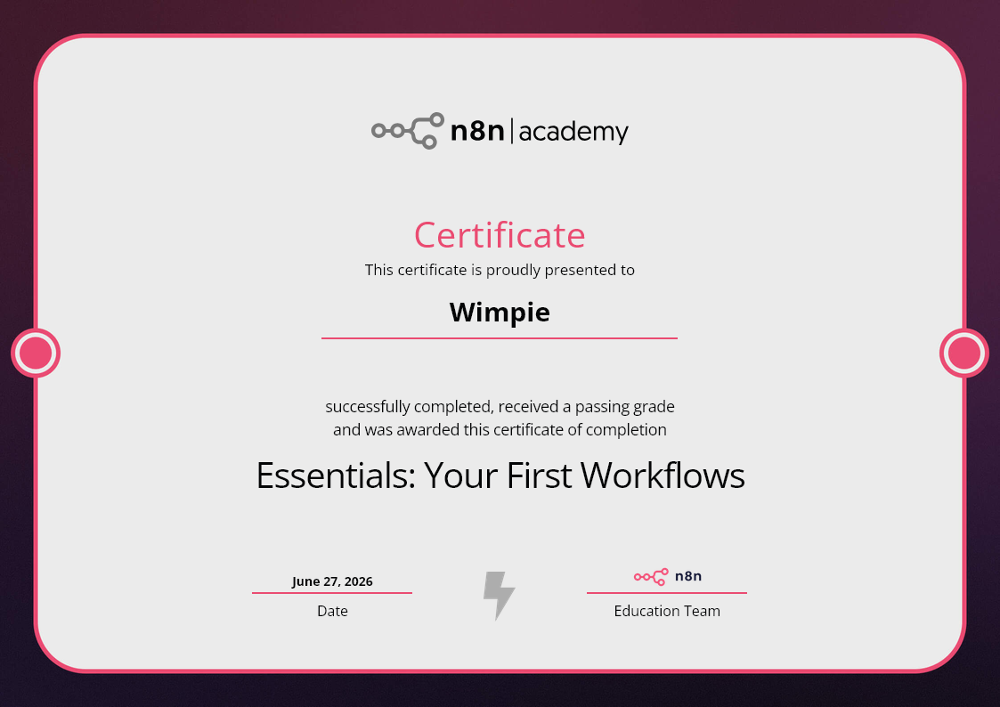

# Automation Engineering

Documenting my journey into automation engineering — building workflows, connecting APIs, and learning software fundamentals to solve real-world operational bottlenecks.

**Nova Draft (my automation practice):** [nova-draft-systems.lovable.app](https://nova-draft-systems.lovable.app) · **LinkedIn:** [linkedin.com/company/nova-draft43](https://linkedin.com/company/nova-draft43)

## Background
Junior AI Automation Developer based in South Africa, building toward remote automation engineering work while growing Nova Draft, my automation practice. Started after seeing repetitive manual processes firsthand while managing operations at a car wash.

## What I'm building
- n8n workflow automation (lead capture, scoring, routing)
- API integrations (Slack, Gmail, Google Sheets, Resend)
- Multi-tenant database architecture (Postgres/Supabase)
- Python fundamentals (FNB App Academy)

## Log
Entries below, most recent first.

---
---

### Self-Hosted n8n Migration & Lead Capture Automation

Built a full lead-capture automation: a webhook receives form submissions, scores each lead hot/warm/cold based on message content, then routes to Slack, email, and Google Sheets depending on score.

Midway through, my n8n Cloud trial expired, forcing a full migration to a self-hosted instance on Railway (Postgres + n8n containers). Every credential had to be rebuilt from scratch:

- **Slack** — created a Slack App, configured Bot Token Scopes, installed it to the workspace, invited the bot into the target channel.
- **Google Sheets** — set up a Google Cloud Console project, configured the OAuth consent screen, and resolved an "ineligible test user" error caused by a stray typo in my email.
- **Email delivery** — hit `ECONNREFUSED` and `ENETUNREACH` errors trying to send via Gmail SMTP. Root cause: Railway blocks outbound SMTP ports by default (common anti-spam measure on cloud hosts). Fixed by switching to the Resend API (HTTPS-based, not blocked).

One stubborn bug: a Filter node kept discarding valid leads no matter how I configured the condition (tried `exists`, `is not empty`, direct field references). Eventually gave up on the visual node and moved the same validation logic into the Code node instead — a good reminder that sometimes a code workaround beats fighting a UI node.

**What I learned:** infrastructure constraints (blocked ports, expired trials, encryption keys not persisting across restarts) often cause more debugging time than the actual logic does. Documenting the root cause — not just the fix — makes the next migration faster.

---

### Multi-Tenant Database Architecture (Pawn Shop Client Project)

Designed and built the database for a pawn shop auction management platform — a real client project involving stock intake, live bidding, and automated auction scheduling.

Started with a multi-tenant schema from day one: every table scoped by `shop_id`, so the platform can support multiple pawn shops rather than being locked to one. Compared my own proposed schema against a second AI-generated version for a sanity check, then merged the best parts of both into a final 7-table design (`shops`, `items`, `item_images`, `auctions`, `auction_items`, `bids`, `sales_history`) using proper Postgres enums for status fields instead of loose text.

Caught and fixed a real regression mid-project: an earlier, simplified version of the schema had been deployed without `shop_id` anywhere and used a flat array column for images instead of a proper relational table — a significant step back from the agreed design. Rebuilt it cleanly via a sequenced set of SQL migration scripts run one at a time.

Later added:
- A `pg_cron` job that automatically starts and ends auctions on schedule (previously only a manual button could do this).
- A server-side database trigger to prevent bid race conditions when two bids land at nearly the same time.
- Row-level security scoped to shop ownership, so each shop only sees its own data.

**What I learned:** the cost of skipping multi-tenancy "for now" is paying it back later under pressure. Designing for the real future shape of the data up front — even before there are multiple clients — saves a full rebuild down the line.

---

### Lead Prospecting Automation for Cold Outreach

Built an automation to replace blind cold-calling with a targeted lead list: it finds local businesses with identifiable problems (no website, low review rating, few reviews, complaints about responsiveness) and generates a suggested pitch angle for each one.

Since the self-hosted n8n instance I was using has no built-in AI workflow assistant, I hand-wrote the full workflow from scratch: a daily scheduled trigger searches Google Places for businesses in a target category and location, pulls detailed info per business, scores each one against a set of "pain point" flags, generates a tailored pitch suggestion, and appends qualifying leads to a Google Sheet.

**What I learned:** not every automation needs a no-code AI assistant — sometimes writing the workflow JSON directly is faster and more reliable than fighting a visual builder that doesn't support the integration you need.

---

### Nova Draft Marketing Website

Built and shipped the marketing website for my own automation practice, Nova Draft — nav, hero section, a live-style workflow visualization strip, tech stack showcase, and an audit-request lead form.

Reviewed the actual source code (not just the rendered site) to catch real gaps: the lead form was missing several spec'd fields, and — most importantly — the form wasn't actually sending anywhere yet (an intentional placeholder from the initial build).

Wired up two integrations to make it fully functional:
- **Web3Forms** — sends an instant notification email the moment someone submits the audit request form.
- **EmailJS** — sends an automatic reply back to the person who submitted it, confirming their request was received.

Tested end-to-end with a real submission — both the internal notification and the external auto-reply arrived successfully.

**What I learned:** a marketing site isn't done when it looks right — it's done when someone can submit real information and get a real response. Reading the actual code, not just the browser render, is the only way to catch this kind of gap.

## Certifications
- n8n Level 1 Certified

